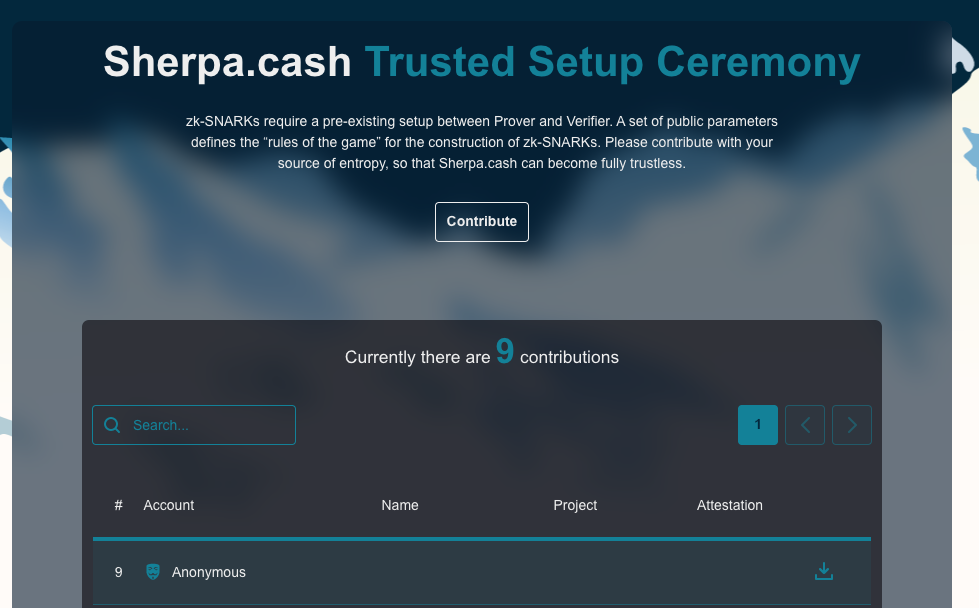
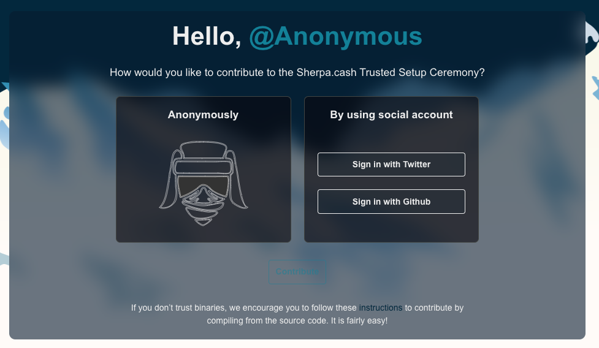
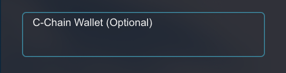
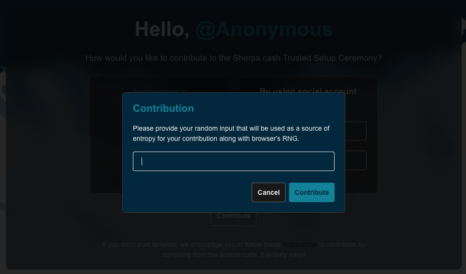
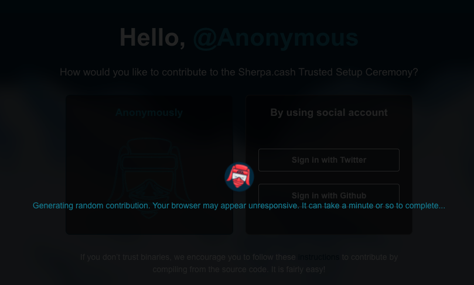
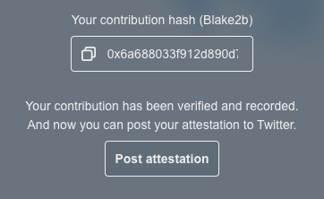

# Trusted Ceremony

Trusted Ceremony is a process to secure our zkSNARKs keys through community participation.  
  
Details here:  
[https://medium.com/sherpa-cash/announcing-the-sherpa-cash-zk-snark-ceremony-27c67671f44a](https://medium.com/sherpa-cash/announcing-the-sherpa-cash-zk-snark-ceremony-27c67671f44a)

## Instructions for participating

Visit the following website in your browser: [https://ceremony.sherpa.cash/](https://ceremony.sherpa.cash/)

### 1. Click Contribute

### 2. Choose your method of Identification

### 3. Enter a c-chain wallet address if you want to qualify for an airdrop

### 4. Click "Contribute"

### 5. Enter a random string \(ex: "abc123"\)

### 4. Wait for browser to generate random contribution

### 5. Post attestation on Twitter \(optional\)

